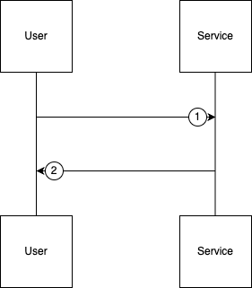

# Confirm Ticket Purchase API Documentation

## 1. Confirm Ticket Purchase

* **URL:** `http://localhost:8080/api/screenings/{id}/confirm`
* **Method:** `POST`
* **Path Param:**

  * `id` (integer) – Screening ID
* **Headers:**

  * `Content-Type: application/json`
* **Body Type:** JSON

### Request Flow



1. **User Request Submission**
   The user sends a POST request to finalize a ticket purchase by providing `user_id` and selected `seat_ids`.

2. **Service Processing and Response**
   The service performs validation (screening existence, seat ownership, reservation state, concurrency control), completes the transaction (creates tickets, updates seat status), sends a notification, and returns either a success response or an appropriate error.

---

### Request Body Example

```json
{
  "user_id": 1,
  "seat_ids": [1, 2, 3]
}
```

---

## Response (Success)

* **Status Code:** 201 Created
* **Body (JSON):**

```json
{
  "message": "Tickets purchased successfully and notification sent",
  "data": [
    {
      "ticket_id": 101,
      "screening_id": 10,
      "seat_id": 1,
      "seat_row": "A",
      "seat_number": "1",
      "created_at": "2026-03-01T18:06:00Z"
    }
  ]
}
```

---

## Response (Failure Scenarios)

### 1. Invalid Screening ID

* **Status Code:** 404 Not Found

```json
{
  "message": "Screening not found",
  "error": "No screening exists with the provided ID"
}
```

### 2. Invalid Request Body / Validation Error

* **Status Code:** 400 Bad Request

```json
{
  "message": "Invalid request payload",
  "error": "user_id must be integer, seat_ids must be non-empty array"
}
```

### 3. User Not Found

* **Status Code:** 404 Not Found

```json
{
  "message": "User not found",
  "error": "Invalid user_id"
}
```

### 4. Seats Not Reserved or Already Sold

* **Status Code:** 409 Conflict

```json
{
  "message": "Seats not reserved or already sold",
  "error": "Seat IDs: [3]"
}
```

### 5. Seat Not Belonging to Screening

* **Status Code:** 400 Bad Request

```json
{
  "message": "Seat does not belong to screening",
  "error": "One or more seat IDs are invalid for this screening"
}
```

### 6. Reservation Expired

* **Status Code:** 410 Gone

```json
{
  "message": "Reservation expired",
  "error": "Reserved seats are no longer valid"
}
```

### 7. Concurrent Purchase Conflict (Race Condition)

* **Status Code:** 409 Conflict

```json
{
  "message": "Seat purchase conflict",
  "error": "Seats were purchased by another user during confirmation"
}
```

### 8. Notification Sending Failure

* **Status Code:** 502 Bad Gateway

```json
{
  "message": "Failed to send notification",
  "error": "Bale API error details"
}
```