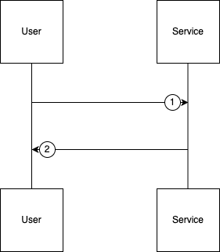

# Retrieve Movies API Documentation

## 1. Retrieve Movies

* **URL:** `http://localhost:8080/api/movies`
* **Method:** `GET`
* **Query Params:** None
* **Headers:**

  * `Content-Type: application/json`
* **Body:** None

### Request Flow



1. The user sends a request to retrieve the list of movies.
2. The server fetches movies from in-memory storage and returns the list.

### Response (Success)

* **Status Code:** 200 OK
* **Body (JSON):**

```json
{
  "data": [
    {
      "id": 1,
      "name": "Oppenheimer",
      "year": 2026,
      "genre": "Drama",
      "director": "Christopher Nolan",
      "duration_minutes": 180,
      "created_at": "2026-02-12T19:45:17Z",
      "updated_at": "2026-02-12T19:45:17Z"
    }
  ]
}
```

### Response (Failure)

* **Status Code:** 500 Internal Server Error (for server or memory issues)
* **Body (JSON):**

```json
{
  "message": "Failed to fetch movies",
  "error": "memory retrieval or internal error details"
}
```