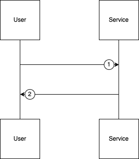

# Reserve Seats for a Screening API Documentation

## 1. Reserve Seats for a Screening

* **URL:** `http://localhost:8080/api/screenings/{id}/reserve`
* **Method:** `POST`
* **Path Param:**

  * `id` (integer) – Screening ID
* **Headers:**

  * `Content-Type: application/json`
* **Body Type:** JSON

---

## Request–Response Flow Summary



### 1. User Request

The client sends a POST request with `user_id` and selected `seat_ids` to temporarily reserve seats for a specific screening.

### 2. Service Processing & Response

The service validates screening and seat availability, applies concurrency control, sets seat state to `RESERVED` with an expiration timestamp, and returns either a success response or a validation/conflict error.

---

## Request Body Example

```json
{
  "user_id": 1,
  "seat_ids": [1, 2, 3]
}
```

---

## Response (Success)

* **Status Code:** 201 Created

```json
{
  "message": "Seats reserved successfully",
  "data": {
    "screening_id": 10,
    "reserved_seats": [1,2,3],
    "expires_at": "2026-03-01T18:05:00Z"
  }
}
```

---

## Response (Failure Scenarios)

### 1. Screening Not Found

* **Status Code:** 404 Not Found

```json
{
  "message": "Screening not found",
  "error": "No screening with given ID"
}
```

### 2. Invalid Screening ID Format

* **Status Code:** 400 Bad Request

```json
{
  "message": "Invalid screening ID",
  "error": "Path parameter must be a valid integer"
}
```

### 3. Invalid Request Payload

* **Status Code:** 400 Bad Request

```json
{
  "message": "Invalid request payload",
  "error": "user_id must be integer, seat_ids must be non-empty array"
}
```

### 4. User Not Found

* **Status Code:** 404 Not Found

```json
{
  "message": "User not found",
  "error": "Invalid user_id"
}
```

### 5. Seat Does Not Belong to Screening

* **Status Code:** 400 Bad Request

```json
{
  "message": "Seat does not belong to screening",
  "error": "One or more seat IDs are invalid for this screening"
}
```

### 6. Some Seats Already Reserved or Sold

* **Status Code:** 409 Conflict

```json
{
  "message": "Some seats are already reserved or sold",
  "error": "Seat IDs: [2] already taken"
}
```
